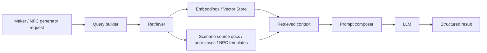

# AI Layer README

메이커용 LLM 제작 도우미와 이후 `RAG + LLM` 확장 기준을 정리한 소스 코드 근처 문서다.

## 1. 현재 상태

- 현재 구현 범위는 `메이커 제작 도우미 V1`이다.
- 현재 구조는 `RAG 없음`이다.
- 메이커 편집기의 현재 로컬 `game` 상태를 그대로 서버로 보내고, 서버가 축약 컨텍스트를 만든 뒤 OpenAI Responses API를 호출한다.
- 기본 모델은 `gpt-5-mini`다.

즉, 지금은 `retrieval 기반 검색 시스템`이 아니라 `현재 작성 중인 게임 JSON을 직접 읽는 context-injection 구조`다.

## 2. 현재 아키텍처

```mermaid
flowchart LR
  A["MakerEditor local game state"] --> B["useMakerAssistant"]
  B --> C["POST /api/maker-assistant"]
  C --> D["buildMakerAssistantContext"]
  D --> E["resolveMakerAssistantResponseMode"]
  E --> F["buildMakerAssistantSystemPrompt / UserPrompt"]
  F --> G["OpenAI Responses API (gpt-5-mini)"]
  G --> H["extractResponseText"]
  H --> I["parseMakerAssistantResult(mode-aware)"]
  I --> J["Assistant drawer UI"]
```



### 처리 흐름

1. 메이커 화면에서 빠른 액션 또는 자유 질문을 보낸다.
2. 클라이언트는 현재 저장 전 로컬 `game` 상태를 `/api/maker-assistant`로 전송한다.
3. 서버는 `game` 전체를 그대로 넘기지 않고, 검증 요약과 핵심 필드만 포함한 축약 컨텍스트를 생성한다.
4. chat 요청이면 `자동 / 가이드 / 문안` 설정과 질문 문장을 바탕으로 응답 모드를 결정한다.
5. 후속 질문 맥락은 Responses API 서버 상태 대신 최근 대화 8턴을 직접 prompt에 포함하는 방식으로 유지한다.
6. `draft` 요청이면 서사형 산문 / 설명형 텍스트 / GM 진행문 프로필 중 하나를 추론해 문체 규칙을 강화한다.
7. 모델 응답은 우선 그대로 파싱하고, 형식이 깨지면 모드별 line-based 포맷으로 한 번 더 복구한다.
8. 프론트는 `guide` 면 분석 카드, `draft` 면 붙여넣기용 본문 카드로 분리 렌더링한다.

## 3. 현재는 왜 RAG가 아닌가

현재 V1 요구사항은 아래 3가지다.

- 단서 / 타임라인 / 배경 간 모순 점검
- 현재 입력 기준 단서 제안
- 지금 무엇부터 작업할지 우선순위 추천

이 세 가지는 모두 `현재 편집 중인 단일 GamePackage` 안에서 해결된다. 별도 문서 검색, 임베딩, 벡터 저장소가 없어도 충분하다. 그래서 지금 구조는 `No-RAG LLM assistant`가 맞다.

## 4. 나중에 확장할 RAG + LLM 구조

아래는 아직 구현되지 않은 Phase 2 방향이다.



### RAG가 필요한 시점

- 여러 시나리오 샘플을 참고해 NPC를 생성하고 싶을 때
- 긴 참고 문서, 규칙 문서, 설정집을 검색해서 답변해야 할 때
- 프로젝트 외부 지식이나 축적된 템플릿을 재활용해야 할 때

현재 메이커 도우미는 여기에 해당하지 않는다. `RAG/LLM 기반 NPC 제작`이 백로그 2순위인 이유도 이 때문이다.

## 5. 모델 / env 설정 위치

### 모델 선택

- 기본 모델: `gpt-5-mini`
- 설정 코드: [`openai.ts`](./openai.ts)
- 함수:
  - `getMakerAssistantModel()`
  - `getMakerAssistantReasoningEffort()`
  - `isMakerAssistantEnabled()`

### 관련 env

- `OPENAI_API_KEY`
- `OPENAI_MODEL`
- `OPENAI_REASONING_EFFORT`
- `OPENAI_ASSISTANT_ENABLED`

## 6. 프롬프트 수정 위치

프롬프트 수정이 필요하면 아래 파일을 본다.

- 시스템 프롬프트: [`maker-assistant-prompts.ts`](./maker-assistant-prompts.ts)
  - `buildMakerAssistantSystemPrompt()`
  - `getTaskGuidelines()`
- 사용자 프롬프트 조립: [`maker-assistant-prompts.ts`](./maker-assistant-prompts.ts)
  - `buildMakerAssistantUserPrompt()`
  - `inferDraftIntent()`
  - `getDraftStyleRules()`
  - `buildDraftPromptContext()`
- 축약 컨텍스트 구성: [`maker-assistant-context.ts`](./maker-assistant-context.ts)

실제로 성능에 가장 큰 영향을 주는 곳은 보통 아래 순서다.

1. `buildMakerAssistantContext()`에서 어떤 데이터를 줄지
2. `buildMakerAssistantSystemPrompt()`에서 어떤 출력 형식을 강제할지
3. `buildDraftPromptContext()`에서 draft용으로 어떤 메타를 줄일지
4. task별 가이드라인을 얼마나 구체적으로 쓰는지

### draft 문체 프로필

현재 `draft` 는 아래 3종류를 구분한다.

- `narrative_prose`
  - 오프닝, 배경, 상세 스토리, 비밀/반전, 엔딩 같은 서사형 입력칸
  - 게임 설명문 대신 산문형 문체를 강하게 유도
- `descriptive_copy`
  - 소개글, 장소 설명, 단서 카드 본문 같은 설명형 입력칸
- `gm_guide`
  - 라운드 멘트, GM 진행 가이드, 투표 안내 같은 운영용 텍스트

특히 `narrative_prose` 에서는 플레이어 수, 단서 개수, 라운드 번호, 타임라인 시각, 해금 조건 같은 설계 메타를 본문에 그대로 쓰지 않도록 막고 있다.

## 7. 응답 파싱 / 구조화 수정 위치

모델 응답이 깨질 때는 아래 파일을 본다.

- API 진입점: [`../../app/api/maker-assistant/route.ts`](../../app/api/maker-assistant/route.ts)
  - `POST()`
  - `resolveMakerAssistantResult()`
  - `extractResponseText()`
- 응답 스키마 / 파서: [`maker-assistant-schema.ts`](./maker-assistant-schema.ts)
  - `makerAssistantRequestSchema`
  - `makerAssistantResultSchema`
  - `parseMakerAssistantResult()`

현재는 `완전 JSON 강제` 대신 아래 포맷도 허용한다.

```text
SUMMARY:
...
FINDINGS:
FINDING|warning|3|null|null|null|제목|상세
ACTIONS:
ACTION|3|작업|이유
QUESTIONS:
QUESTION|후속 질문
```

draft 모드에서는 아래 포맷도 복구한다.

```text
TITLE:
오프닝 제안
BODY:
실제 본문...
NOTES:
NOTE|피해자 이름은 현재 데이터 기준으로 가정함
```

이렇게 둔 이유는 `gpt-5-mini`가 JSON을 가끔 불완전하게 내보내는 경우가 있어, V1에서는 line-based fallback이 더 안정적이기 때문이다.

### 후속 대화 처리 메모

현재는 `previous_response_id` 를 쓰지 않는다.

- 이유: `store: false` 상태의 Responses API와 섞일 때 후속 질문이 `response not found` 로 끊길 수 있었다.
- 대안: 클라이언트에서 최근 대화 8턴을 `conversationHistory` 로 보내고, 서버가 이를 user prompt에 직접 포함한다.
- 관련 파일:
  - [`../../app/maker/[gameId]/edit/_components/useMakerAssistant.ts`](../../app/maker/[gameId]/edit/_components/useMakerAssistant.ts)
  - [`maker-assistant-schema.ts`](./maker-assistant-schema.ts)
  - [`maker-assistant-prompts.ts`](./maker-assistant-prompts.ts)

## 8. UI / 호출 위치

- 훅: [`../../app/maker/[gameId]/edit/_components/useMakerAssistant.ts`](../../app/maker/[gameId]/edit/_components/useMakerAssistant.ts)
- 드로어 UI: [`../../app/maker/[gameId]/edit/_components/MakerAssistantDrawer.tsx`](../../app/maker/[gameId]/edit/_components/MakerAssistantDrawer.tsx)
- 런처 / 도킹 UI:
  - [`../../app/maker/[gameId]/edit/_components/MakerAssistantLauncher.tsx`](../../app/maker/[gameId]/edit/_components/MakerAssistantLauncher.tsx)
  - [`../../app/maker/[gameId]/edit/_components/MakerAssistantDock.tsx`](../../app/maker/[gameId]/edit/_components/MakerAssistantDock.tsx)

빠른 액션 기본 문구는 `useMakerAssistant.ts`의 `QUICK_ACTION_PROMPTS`에서 수정한다.
chat 입력창의 모드 토글과 placeholder는 `MakerAssistantDrawer.tsx`를 보면 된다.
런처 문구와 하단 액션바 충돌 회피는 `MakerAssistantLauncher.tsx`, `MakerAssistantDock.tsx`, `MakerEditor.tsx`에서 같이 본다.

## 9. 이후 작업 추천

### 단기

- 특정 입력칸으로 바로 복사하는 UX
- Step별 draft 템플릿 더 정교화
- 스토리형 문안의 기계적 사실 나열 추가 보정

### 중기

- validation 결과와 AI 결과를 묶어 표시하는 패널
- quick action용 draft 프리셋 도입 여부 검토
- 라운드/엔딩 전용 초안 프리셋 정리

### 장기

- `RAG + LLM 기반 NPC 제작`
- 시나리오 템플릿 검색
- 과거 생성 결과 재활용
